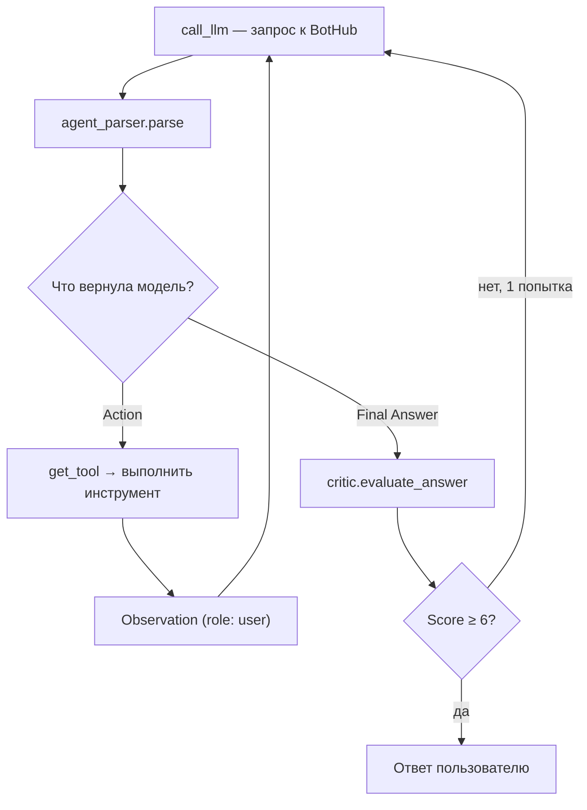

# Orion (J.A.R.V.I.S.)

Автономный Telegram-агент на архитектуре **ReAct** (Reasoning + Acting). Не чат-бот с промптом, а агент, который сам решает: ответить сразу или вызвать инструмент, хранит факты о пользователе в долгосрочной памяти и оценивает собственные ответы перед отправкой (Self-Critic).

Проект — часть self-directed курса «AI / Agent Systems Specialist» (Месяц 1: «Первый Агент»). Полный план развития — `План_развития.docx`.

---

## Быстрый старт

```bash
git clone <repo_url> && cd orion
python -m venv venv && venv\Scripts\activate    # Windows
pip install aiogram httpx psycopg2-binary python-dotenv fastapi uvicorn

# создать .env: BOT_TOKEN, BOTHUB_API_KEY, DATABASE_URL
python main.py
```

Подробности — переменные окружения и прод-деплой см. в разделе [Установка и запуск](#установка-и-запуск).

---

## Оглавление

- [Быстрый старт](#быстрый-старт)
- [Архитектура](#архитектура)
- [ReAct-цикл](#react-цикл)
- [Пример диалога](#пример-диалога-иллюстративный)
- [Память агента](#память-агента)
- [Инструменты (Registry)](#инструменты-registry)
- [Команды Telegram](#команды-telegram)
- [Веб-API (FastAPI)](#веб-api-fastapi)
- [Установка и запуск](#установка-и-запуск)
- [Переменные окружения](#переменные-окружения)
- [Структура проекта](#структура-проекта)
- [Известные ограничения](#известные-ограничения)
- [Дорожная карта](#дорожная-карта)

---

## Архитектура

```
Telegram
   │
   ▼
handlers/user_handlers.py          aiogram Router, process_echo()
   │
   ▼
services/agent.py :: run_agent()   таймаут 60s на всё сообщение
   │
   ▼
_run_agent_loop()  ──►  [ ReAct-цикл, схема ниже ]  ──►  Final Answer
   │
   ▼
Ответ в Telegram (HTML) + save_message() в Communication
```

Контекст для цикла собирается из `services/constitution.py :: build_constitution()` (системный промпт) и `services/database` (факты, рефлексии, история). Сам цикл — см. [ReAct-цикл](#react-цикл).

Отдельный процесс — веб-слой:

```
api/main1.py (FastAPI, порт 8000)
  ├─► services/database        — сообщения, факты, рефлексии, статистика
  └─► services/log_streamer.py — tail -f logs/bot.log → SSE → /logs
```

Bot и API — два независимых процесса (`bot.service` и `logs_api.service` в systemd), читающих одну и ту же PostgreSQL базу.

---

## ReAct-цикл



Максимум 5 итераций (`MAX_ITERATIONS`) и 3 реальных вызова инструмента (`MAX_TOOL_CALLS`) — при превышении цикл принудительно завершается.

Формат ответа LLM разбирается `RobustReActParser` (`services/parser.py`) по ключевым словам:

| Поле | Кто заполняет | Назначение |
|---|---|---|
| `Plan` | LLM | план решения задачи |
| `Thought` | LLM | рассуждение на текущем шаге |
| `Action` | LLM | имя инструмента из реестра |
| `Action Input` | LLM | параметры инструмента (JSON / key=value, парсится каскадно) |
| `Predict` | LLM | ожидаемый результат вызова |
| `Plan Update` | LLM | корректировка плана — **сейчас только для лога**, на ветвление цикла не влияет |
| `Observation` | **код агента** | результат выполнения инструмента, добавляется как `role: "user"` |
| `Final Answer` | LLM | финальный ответ пользователю |

Важно: `Observation` никогда не генерируется моделью — только код агента, после реального вызова функции. Если модель в одной реплике выдаёт сразу и `Action`, и `Final Answer` — это физически невозможно без реального Observation между ними. Парсер такое ловит: отклоняет `Final Answer` и обрезает `raw_output`, чтобы модель не приняла свою же галлюцинацию за факт на следующем шаге.

Лимиты цикла (`services/agent.py`):

| Константа | Значение | Смысл |
|---|---|---|
| `AGENT_TIMEOUT` | 60 сек | жёсткий тайм-аут на всю обработку сообщения |
| `MAX_ITERATIONS` | 5 | максимум шагов LLM за один запрос |
| `MAX_TOOL_CALLS` | 3 | максимум реальных вызовов инструментов |
| `MAX_CRITIC_ATTEMPTS` | 1 | сколько раз критик может отправить ответ на доработку |

Self-Critic (`services/critic.py`) оценивает черновой `Final Answer` по трём критериям (точность / полнота / соответствие роли). Порог — `score >= 6`. При сбое формата ответа критика — **fail-open**: ответ пропускается, чтобы Сэр не остался без ответа из-за бага в критике.

---

## Пример диалога (иллюстративный)

Ниже — упрощённая иллюстрация одного прохода цикла (не реальный лог, а демонстрация формата):

```
Пользователь: Запомни, что я перехожу на удалённую работу с понедельника

── Шаг 1 ──
Plan: Сохранить факт о пользователе
Thought: Это личный факт о рабочем статусе, нужно вызвать save_fact
Action: save_fact
Action Input: {"fact": "Перешёл на удалённую работу с понедельника", "importance": "medium"}
Predict: Факт будет сохранён, при конфликте — старый факт деактивируется

[код агента подставляет user_id → вызывает tools.py::_save_fact →
 add_fact_with_check() сверяет с существующими фактами через LLM]

Observation: Факт сохранён: 'Перешёл на удалённую работу с понедельника' (важность: medium)

── Шаг 2 ──
Thought: Инструмент отработал успешно, можно завершать
Final Answer: Записал, Сэр. Учту, что теперь вы работаете удалённо.

[services/critic.py :: evaluate_answer() → Score: 8 → passed]

Бот: Записал, Сэр. Учту, что теперь вы работаете удалённо.
```

---

## Память агента

Три слоя (плюс диалоговая история) в PostgreSQL, реализованы в `services/database/`:

| Слой | Таблица | Файл | Назначение |
|---|---|---|---|
| Диалоговая | `Communication` | `chat_history.py` | История `user`/`assistant`, мягкое удаление (`is_active`), окно — `config.MAX_ACTIVE_MESSAGES` (50) |
| Рабочая | `WorkingMemory` | `working_memory.py` | Текущая активная задача пользователя, `UPSERT` по `user_id` |
| Долгосрочная | `LongTermMemory` | `long_term.py` | Факты о пользователе, `ON CONFLICT (user_id, fact)` обновляет `importance`, мягкое удаление |
| Рефлексивная | `ReflectionMemory` | `reflection_memory.py` | Сжатые отчёты по завершённым задачам, окно — `config.MAX_ACTIVE_REFLECTION` (25) |

`services/memory_manager.py` — оркестратор поверх слоёв:

- **`add_fact_with_check`** — спрашивает LLM, нет ли среди существующих фактов дубля или противоречия; при совпадении старый факт деактивируется, новый добавляется.
- **`create_reflection`** — по завершённой задаче просит LLM сформировать краткий отчёт (цель / действия / итог) и сохраняет его в `ReflectionMemory`.

---

## Инструменты (Registry)

`services/tools.py` — паттерн Registry: `dict[str, dict]`, где значение — `{name, description, function, parameters}`. `get_tools_description()` формирует текстовый список для системного промпта; модель выбирает инструмент по имени, реальный вызов идёт через `get_tool(name)["function"]`.

| Инструмент | Описание | Параметры |
|---|---|---|
| `get_current_time` | Текущее время; при некорректном таймзоне (например, LLM передал `"MSK"` вместо `"Europe/Moscow"`) откатывается на UTC | `timezone` (опц.) |
| `save_fact` | Сохраняет факт с проверкой на дубликат/конфликт | `user_id`, `fact`, `importance` (`low`/`medium`/`high`) |
| `get_user_facts` | Возвращает все активные факты пользователя | `user_id` |
| `get_reflection` | Возвращает сохранённые рефлексии | `user_id` |
| `delete_user_facts` | Деактивирует факт по id | `user_id`, `fact_id` |

`user_id` во всех случаях подставляется кодом агента автоматически (если `"user_id"` есть в `parameters` инструмента) — модель не может и не должна знать Telegram ID.

---

## Команды Telegram

| Команда | Действие |
|---|---|
| `/start` | Приветствие, проверка запуска |
| `/help` | Список команд |
| `/clear` | Мягкое удаление истории диалога текущего пользователя (`is_active = 0`) |
| `/hard_delete` | Полная очистка таблицы `Communication` (`TRUNCATE ... RESTART IDENTITY`) — **без проверки прав**, см. [Известные ограничения](#известные-ограничения) |
| `/memory` | Показывает до 5 фактов и до 3 последних рефлексий |
| `/stop` | Отменяет текущую активную задачу пользователя через `task_registry` |
| произвольный текст | Запускает `run_agent()` → полный ReAct-цикл |

Если новое сообщение приходит, пока предыдущий запрос ещё обрабатывается — `task_registry.register_task()` отменяет предыдущую задачу того же `user_id` перед регистрацией новой (защита от параллельной обработки одного пользователя).

---

## Веб-API (FastAPI)

`api/main1.py`, запускается отдельным процессом (`logs_api.service`), доступ — через SSH-туннель (`ssh -L 8000:localhost:8000`).

| Метод | Путь | Действие |
|---|---|---|
| `GET` | `/users/{user_id}/messages?limit=` | История сообщений |
| `POST` | `/messages` | Создать сообщение |
| `DELETE` | `/users/{user_id}/messages` | Мягкое удаление сообщений |
| `GET` | `/users/{user_id}/facts` | Активные факты |
| `DELETE` | `/users/{user_id}/facts/{fact_id}` | Деактивировать факт |
| `GET` | `/users/{user_id}/reflections` | Рефлексии пользователя |
| `GET` | `/users` | Список всех user_id |
| `GET` | `/stats` | Общая статистика (сообщения/пользователи) |
| `GET` | `/logs` | HTML-страница просмотра логов в реальном времени |
| `GET` | `/logs/stream` | SSE-стрим `logs/bot.log` |


---

## Установка и запуск

### Локально (разработка)

```bash
git clone <repo_url>
cd orion
python -m venv venv
venv\Scripts\activate        # Windows
pip install aiogram httpx psycopg2-binary python-dotenv fastapi uvicorn

# создать .env в корне (см. раздел ниже)
python main.py
```

### FastAPI-сервер логов/API отдельно

```bash
uvicorn api.main1:app --host 0.0.0.0 --port 8000
```

### Продакшен (VPS Ubuntu 22.04)

Локальная разработка → GitHub → `git pull` на сервере (прямое редактирование на сервере не используется).

```bash
git pull
sudo systemctl restart bot.service
sudo systemctl restart logs_api.service
```

---

## Переменные окружения

`.env` в корне проекта, читается через `python-dotenv` в `config.py`:

| Переменная | Обязательна | Назначение |
|---|---|---|
| `BOT_TOKEN` | да | токен Telegram-бота |
| `BOTHUB_API_KEY` | да | ключ BotHub-прокси (роутинг на OpenRouter/SiliconFlow) |
| `DATABASE_URL` | да | строка подключения PostgreSQL (прод) |
| `TEST_DB_URL` | для тестов | строка подключения к тестовой БД |
| `FOLDER_ID` | нет | читается в `config.py`, в коде агента не используется — вероятно, остаток от ранней интеграции |

---

## Структура проекта

```
.
├── main.py                      # точка входа, init_db + dp.start_polling
├── config.py                    # env-переменные, тарифы BotHub
├── logger.py                    # настройка root-логгера
├── handlers/
│   └── user_handlers.py         # aiogram Router: команды + обработчик текста
├── services/
│   ├── agent.py                 # run_agent / _run_agent_loop — ReAct-цикл
│   ├── ai_manager.py            # call_llm — транспорт к BotHub API
│   ├── parser.py                # RobustReActParser — regex-парсинг вывода LLM
│   ├── tools.py                 # Registry инструментов
│   ├── constitution.py          # build_constitution — системный промпт агента
│   ├── critic.py                # Self-Critic (evaluate_answer)
│   ├── memory_manager.py        # create_reflection, add_fact_with_check
│   ├── task_registry.py         # реестр активных asyncio.Task для /stop
│   ├── log_streamer.py          # tail -f для SSE-стрима логов
│   └── database/
│       ├── __init__.py          # публичный API пакета
│       ├── base.py              # init_db, get_connection
│       ├── chat_history.py      # Communication: save/get/delete
│       ├── working_memory.py    # WorkingMemory: set/get/clear
│       ├── long_term.py         # LongTermMemory: add/get/deactivate
│       └── reflection_memory.py # ReflectionMemory: save/get
└── api/
    └── main1.py                 # FastAPI: /messages, /facts, /reflections, /logs
```

---

## Известные ограничения

- **`get_facts()` может вернуть `None`** при ошибке БД — в `agent.py` это уронит `len(facts)` с `TypeError`.
- **`psycopg2` синхронный** — блокирует event loop, из-за чего `AGENT_TIMEOUT=60s` не является «жёстким» для операций с БД. Решение — `asyncio.to_thread()`.
- **`/hard_delete` без проверки прав** — доступна любому пользователю, полностью очищает `Communication`.
- **`create_reflection` не подключена к потоку** — функция готова в `memory_manager.py`, но нет `set_task`/`/done` в `user_handlers.py`, запускающих её.
- **`Plan Update`** парсится, но используется только для лога — на ветвление цикла не влияет.


---